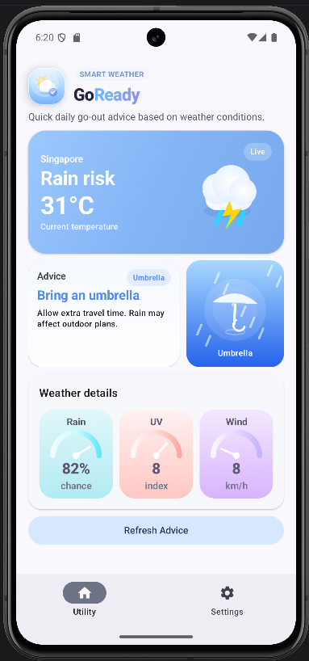
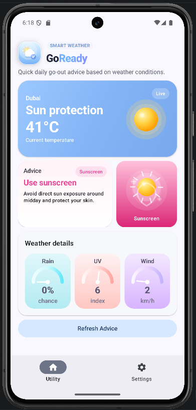
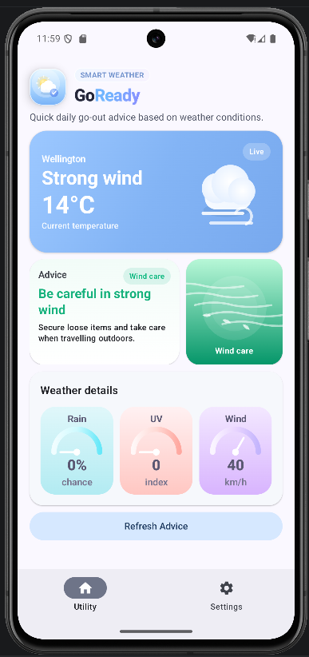
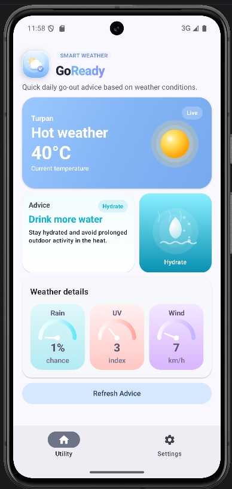
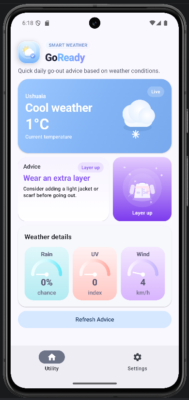
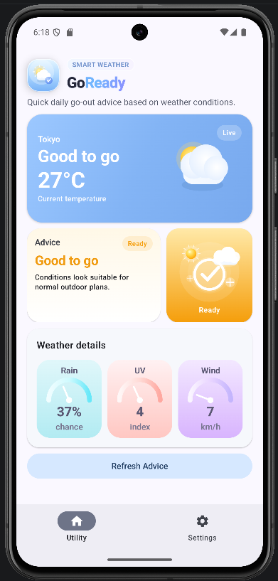

# GoReady

GoReady is a practical weather-based application designed to help users quickly decide what to prepare before going out. The app transforms real-time weather data into concise and practical travel suggestions, eliminating the need for users to interpret raw weather data themselves.

GoReady focuses on solving a common everyday problem based on real-world weather conditions:

**What should I prepare before going out?**

The app displays the selected city, current temperature, weather conditions, key suggestions, visual suggestions, optional weather detail indicators, and a manual refresh button in a clean and intuitive interface.

This project was developed for **CP3406 Course Assessment 1: Practical Applications**.

---

## App Concept

GoReady is designed as a focused utility app for everyday outdoor preparation.

Many weather apps provide large amounts of information, such as hourly forecasts, radar maps, humidity, pressure, long-term trends, and severe weather reports. GoReady intentionally avoids overloading the user. It focuses only on the weather information that is most useful for a quick go-out decision:

* Temperature
* Rain chance
* UV index
* Wind speed

The app then converts these weather conditions into practical advice, such as:

* Bring an umbrella
* Use sunscreen
* Be careful in strong wind
* Drink more water
* Wear an extra layer
* Good to go

The goal is to make the app fast, readable, and useful in everyday life.

---

## Main Purpose

The main purpose of GoReady is to help users make quick outdoor preparation decisions based on live weather conditions.

The app is designed for everyday moments when users need to decide what to prepare before leaving home, such as going to class, going to work, walking outside, commuting, exercising outdoors, or making short daily trips. Instead of asking users to read and interpret multiple weather values by themselves, GoReady turns live weather data into one clear and practical recommendation.

GoReady focuses on four weather factors that directly affect outdoor preparation:

* **Rain chance** helps users decide whether they should bring an umbrella.
* **UV index** helps users decide whether they should use sunscreen or avoid strong sun exposure.
* **Wind speed** helps users know when they should be more careful outdoors.
* **Temperature** helps users decide whether they should drink more water in hot weather or wear an extra layer in cooler weather.

The app is not intended to replace a full weather forecast app. It does not try to provide detailed hourly forecasts, weekly forecasts, radar maps, or advanced weather reports. Instead, it simplifies weather information into a direct go-out advice message.

This makes GoReady useful as a utility app because it supports fast decision-making, reduces information overload, and presents the most relevant weather advice in an at-a-glance format.

---

## Project Structure

The project is organized into clear layers so that the weather data, app logic, UI state, and Compose UI components are separated.

```text
CP3406_CP5307_Utility_App_Starter_Template

├── app
│   ├── manifests
│   │   └── AndroidManifest.xml
│   │
│   ├── kotlin+java/au.edu.jcu.cp3406_cp5307_utilityappstartertemplate
│   │   ├── data
│   │   │   ├── WeatherRepository.kt
│   │   │   └── WeatherSnapshot.kt
│   │   │
│   │   ├── di
│   │   │   └── AppContainer.kt
│   │   │
│   │   ├── domain
│   │   │   ├── AdviceHelper.kt
│   │   │   ├── AdviceType.kt
│   │   │   └── WeatherAdviceHelper.kt
│   │   │
│   │   ├── network
│   │   │   ├── OpenMeteoResponse.kt
│   │   │   ├── RetrofitInstance.kt
│   │   │   └── WeatherApiService.kt
│   │   │
│   │   ├── ui
│   │   │   ├── components
│   │   │   │   ├── AdviceTextCard.kt
│   │   │   │   ├── AdviceVisualCard.kt
│   │   │   │   ├── CitySelectionCard.kt
│   │   │   │   ├── GoReadyBrandHeader.kt
│   │   │   │   ├── HeroWeatherIcon.kt
│   │   │   │   ├── SettingSwitchRow.kt
│   │   │   │   └── WeatherGaugeCard.kt
│   │   │   │
│   │   │   ├── theme
│   │   │   │   ├── Color.kt
│   │   │   │   ├── Theme.kt
│   │   │   │   └── Type.kt
│   │   │   │
│   │   │   ├── BackgroundMusicManager.kt
│   │   │   ├── GoReadyUiState.kt
│   │   │   ├── GoReadyViewModel.kt
│   │   │   ├── GoReadyViewModelFactory.kt
│   │   │   ├── SettingsScreen.kt
│   │   │   ├── UtilityApp.kt
│   │   │   └── UtilityScreen.kt
│   │   │
│   │   └── MainActivity.kt
│   │
│   ├── res
│   │   ├── raw
│   │   │   └── background_music.mp3
│   │   │
│   │   └── values
│   │       ├── colors.xml
│   │       ├── strings.xml
│   │       └── themes.xml
│   │
│   └── build.gradle.kts
│
├── README.md
├── build.gradle.kts
└── settings.gradle.kts
```
---

## Required Permission

The app requires Internet permission because it fetches live weather data from the Open-Meteo API.

```xml
<uses-permission android:name="android.permission.INTERNET" />
```

---

## Key Features

### 1. Live Weather Data

GoReady fetches live weather data from the Open-Meteo API using Retrofit.

The app requests weather information including:

* Current temperature
* Current wind speed
* Weather code
* Hourly precipitation probability
* Hourly UV index

The API response is mapped into the app’s own `WeatherSnapshot` model. This model stores the city name, temperature, rain chance, UV index, and wind speed used by the UI.

---

### 2. Weather-Based Go-Out Advice

The app uses weather values to generate practical advice for the user.

1. High rain chance → bring an umbrella
2. High UV index → use sunscreen
3. Strong wind → be careful outdoors
4. Hot weather → drink more water
5. Cool weather → wear an extra layer
6. Normal conditions → good to go

This makes the app more useful than simply showing numbers. The user can immediately understand what action they should take.

In addition to text-based advice, GoReady also visualizes each advice type through a **dynamic hero weather icon** and an **animated visual advice card**. This helps users understand the recommendation more quickly and makes the interface more engaging.

#### Visual Representation of Advice

Each advice type is supported by a matching visual style:

- **Rain advice** uses umbrella and rain-related visuals.
- **UV advice** uses sun protection visuals.
- **Wind advice** uses wind movement visuals.
- **Hydration advice** uses water-themed visuals.
- **Cool weather advice** uses winter clothing visuals.
- **Good-to-go advice** uses a positive checkmark visual.

These visual elements are implemented using Jetpack Compose Canvas and simple animations, allowing the app to present weather advice in a clearer and more intuitive way.

#### Example Advice States

Below are examples of how the app presents different advice scenarios.
### 2. Weather-Based Go-Out Advice

The app uses weather values to generate practical advice for the user.

1. High rain chance → bring an umbrella
2. High UV index → use sunscreen
3. Strong wind → be careful outdoors
4. Hot weather → drink more water
5. Cool weather → wear an extra layer
6. Normal conditions → good to go

This makes the app more useful than simply showing numbers. The user can immediately understand what action they should take.

In addition to text-based advice, GoReady also visualizes each advice type through a **dynamic hero weather icon** and an **animated visual advice card**. This helps users understand the recommendation more quickly and makes the interface more engaging.

#### Visual Representation of Advice

Each advice type is supported by a matching visual style:

- **Rain advice** uses umbrella and rain-related visuals.
- **UV advice** uses sun protection visuals.
- **Wind advice** uses wind movement visuals.
- **Hydration advice** uses water-themed visuals.
- **Cool weather advice** uses winter clothing visuals.
- **Good-to-go advice** uses a positive checkmark visual.

These visual elements are implemented using Jetpack Compose Canvas and simple animations, allowing the app to present weather advice in a clearer and more intuitive way.

#### Example Advice States

Below are examples of how the app presents different advice scenarios.

##### Rain Advice



*Figure 1. Example of the rain advice state. When the rain chance is high (>=60), the app recommends bringing an umbrella. The interface also shows rain-related visual feedback to reinforce the advice.*

##### UV / Sunscreen Advice



*Figure 2. Example of the sunscreen advice state. When the UV index is high(>=6), the app recommends using sunscreen and presents sun-protection-themed visuals.*

##### Wind Advice



*Figure 3. Example of the wind-care advice state. When wind speed is high(>=25), the app warns the user to be more careful outdoors.*

##### Hydration Advice



*Figure 4. Example of the hydration advice state. When the weather is hot(>=30), the app recommends drinking more water before going outside.*

##### Cool Weather / Layer-Up Advice



*Figure 5. Example of the layer-up advice state. When the weather is cool(<=18), the app recommends wearing an extra layer.*

##### Good-to-Go Advice



*Figure 6. Example of the ready-to-go state. When no weather condition requires special preparation, the app shows that conditions are good to go.*

---

### 3. At-a-Glance Utility Screen

The Utility screen is the main screen of the app. It is designed to show the most important information quickly.

The Utility screen includes:

* GoReady brand header
* Selected city
* Current go-out status
* Current temperature
* Live weather badge
* Weather-based hero icon
* Main advice card
* Animated visual advice card
* Optional weather detail gauges
* Manual refresh button

The screen is scrollable, so the layout remains usable on smaller devices.

---

### 4. Weather Hero Card

The hero card presents the most important weather information at the top of the main screen.

It shows:

* The selected city
* A short weather status
* The current temperature
* A “Live” badge
* A weather icon that changes based on the current condition

The purpose of this card is to make the main information visible immediately without requiring the user to scroll or read a long forecast.

---

### 5. Dynamic Weather Icon

The main weather icon changes depending on the current weather condition.

The icon can represent:

* Rain
* Strong sun / UV risk
* Strong wind
* Hot weather
* Cool weather
* Good-to-go conditions

This visual feedback helps users recognize the weather situation quickly.

---

### 6. Advice Text Card

The advice text card is the main written recommendation area on the Utility screen.

It tells the user what they should prepare or pay attention to before going outside. For example, the card may show advice such as **Bring an umbrella**, **Use sunscreen**, **Drink more water**, **Wear an extra layer**, or **Good to go**.

The card displays three main parts:

* **Advice category label** - shows the type of advice, such as Umbrella, Sunscreen, Hydrate, Layer up, Wind care, or Good to go.
* **Main advice headline** - gives the user the most important recommendation in a short sentence.
* **Advice detail text** - provides a short explanation of why this advice is shown.

The text changes automatically based on the current weather condition. It also responds to the Settings screen. When **Detailed advice** is turned on, the card shows a longer explanation. When it is turned off, the card shows a shorter and simpler message.

This card is important because it turns weather data into a clear action for the user, instead of only showing numbers such as rain chance, UV index, wind speed, or temperature.

---

### 7. Animated Visual Advice Card

GoReady includes an animated visual advice card to make the app more engaging and easier to understand.

The visual card changes based on the advice type:

* Umbrella scene for rain advice
* Sun protection scene for sunscreen advice
* Water scene for hydration advice
* Winter clothing scene for cool weather advice
* Wind scene for strong wind advice
* Checkmark scene for good-to-go advice

These visuals are drawn using Jetpack Compose Canvas and simple animations.

---

### 8. Settings Screen

The Settings screen is the second main screen in the app. Users can open it from the bottom navigation bar by selecting **Settings**.

This screen is used to control how the main Utility screen looks and behaves. It does not only store preferences; each setting directly changes part of the main weather advice screen.

The Settings screen includes the following controls:

* **City selection** - lets the user choose which city should be used for live weather advice. After a city is selected, the Utility screen updates the city name, temperature, weather status, advice, icon, and weather details for that city.
* **Use Fahrenheit** - changes the temperature display from Celsius to Fahrenheit on the Utility screen.
* **Show details** - shows or hides the weather detail gauge section, including rain chance, UV index, and wind speed.
* **Detailed advice** - changes the advice card between a shorter message and a more detailed explanation.
* **Expand advice card** - changes the layout of the advice area. When this is turned on, the text advice card becomes wider and easier to read. When it is turned off, the text advice card and animated visual card are shown together.
* **Background music** - turns the optional background music on or off while using the app.

These settings are managed through the ViewModel state. When the user changes a setting, the Utility screen updates immediately based on the new state.

---

## Design Rationale

### User Experience Design

The app keeps interaction simple and predictable. Users mainly need to:

* Check the Utility screen for current weather advice
* Open the Settings screen from the bottom navigation bar
* Select a city
* Change display preferences using switches
* Press **Refresh Weather** to update the live data

This minimal interaction style makes the app easy to use as a daily utility tool.

### Information Hierarchy

The Utility screen is organized so the most important information appears first. The user sees the selected city, weather status, temperature, main advice, visual feedback, optional weather details, and refresh action in a clear order.

This structure helps users understand the key message quickly without reading a full weather report.

### Visual Design

GoReady uses rounded cards, pastel gradients, soft shadows, clear typography, and weather-themed visuals to create a friendly and readable interface.

The advice is also supported by visual feedback. The hero weather icon, advice text card, and animated visual card change based on the current advice type, such as rain, UV protection, hydration, wind care, cool weather, or good-to-go conditions.

### Responsive and Modular Layout

Both the Utility screen and Settings screen use vertical scrolling, so the app remains usable on smaller devices.

The UI is also divided into reusable Jetpack Compose components. This keeps the code more organized and makes the interface easier to adjust or extend.

---

## Technical Implementation

GoReady is built with Kotlin and Jetpack Compose using a simple layered architecture.

| Area | Implementation |
|---|---|
| Language | Kotlin |
| UI Framework | Jetpack Compose |
| Design System | Material Design 3 |
| State Management | ViewModel and Compose state |
| Asynchronous Work | Kotlin Coroutines |
| Networking | Retrofit |
| JSON Mapping | Gson Converter |
| Weather Data Source | Open-Meteo API |
| Media Playback | Android MediaPlayer |

---

## Architecture

The app separates UI, state management, data access, network requests, and domain logic.

```text
UI Layer
   ↓
ViewModel Layer
   ↓
Repository Layer
   ↓
Network Layer
   ↓
Open-Meteo API
```

This structure keeps the app easier to understand, maintain, and extend.

### Main Architecture Responsibilities

| Layer | Files | Responsibility |
|---|---|---|
| Data Layer | `WeatherSnapshot.kt`, `WeatherRepository.kt` | Stores the weather model, supported city list, city coordinates, and repository logic for loading weather data. |
| Dependency Injection | `AppContainer.kt`, `GoReadyViewModelFactory.kt` | Provides the API service and repository to the ViewModel without creating them directly inside the ViewModel. |
| Domain Layer | `AdviceType.kt`, `AdviceHelper.kt`, `WeatherAdviceHelper.kt` | Converts raw weather values into advice, status text, visual labels, and formatted temperature text. |
| Network Layer | `RetrofitInstance.kt`, `WeatherApiService.kt`, `OpenMeteoResponse.kt` | Connects to the Open-Meteo API and maps the API response into Kotlin data classes. |
| UI State and Logic | `GoReadyUiState.kt`, `GoReadyViewModel.kt` | Manages selected city, weather data, settings, loading state, error state, and manual refresh. |
| Main UI | `MainActivity.kt`, `UtilityApp.kt`, `UtilityScreen.kt`, `SettingsScreen.kt` | Starts the app, sets up navigation, displays the main weather advice screen, and provides user settings. |
| UI Components | `GoReadyBrandHeader.kt`, `HeroWeatherIcon.kt`, `AdviceTextCard.kt`, `AdviceVisualCard.kt`, `WeatherGaugeCard.kt`, `CitySelectionCard.kt`, `SettingSwitchRow.kt` | Provides reusable UI elements for branding, advice display, animated visuals, gauges, city selection, and settings rows. |
| Media | `BackgroundMusicManager.kt` | Manages optional background music using Android MediaPlayer. |

---

## How the App Works

1. The app starts from `MainActivity`.
2. `UtilityApp` creates the app container and ViewModel.
3. The ViewModel requests weather data for the selected city.
4. The repository uses Retrofit to call the Open-Meteo API.
5. The API response is converted into a `WeatherSnapshot`.
6. Domain helper functions convert the weather data into status text and advice.
7. The Utility screen displays the weather, advice, visuals, and optional detail gauges.
8. The Settings screen lets users change the city, unit, advice display, detail visibility, card layout, and background music setting.


